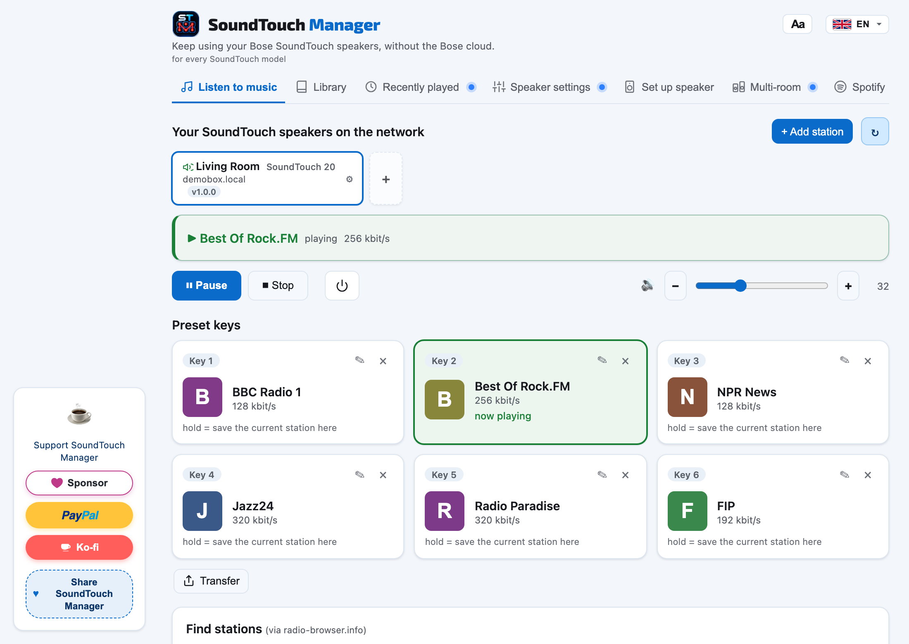
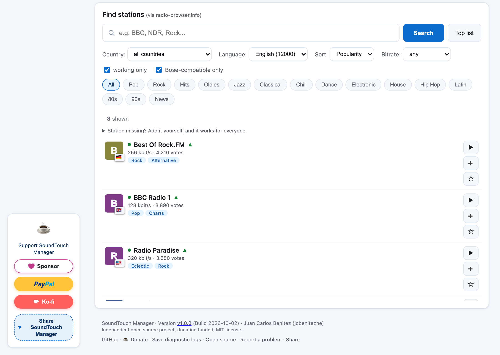
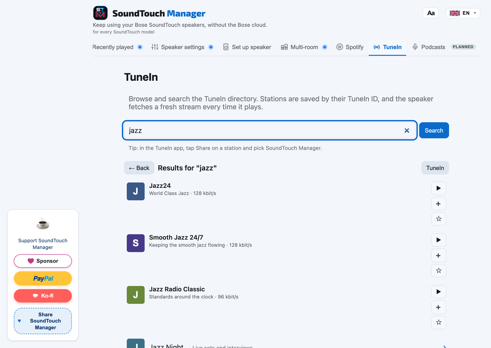
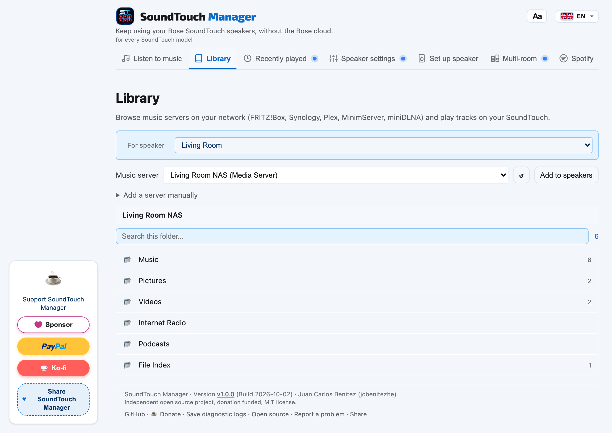
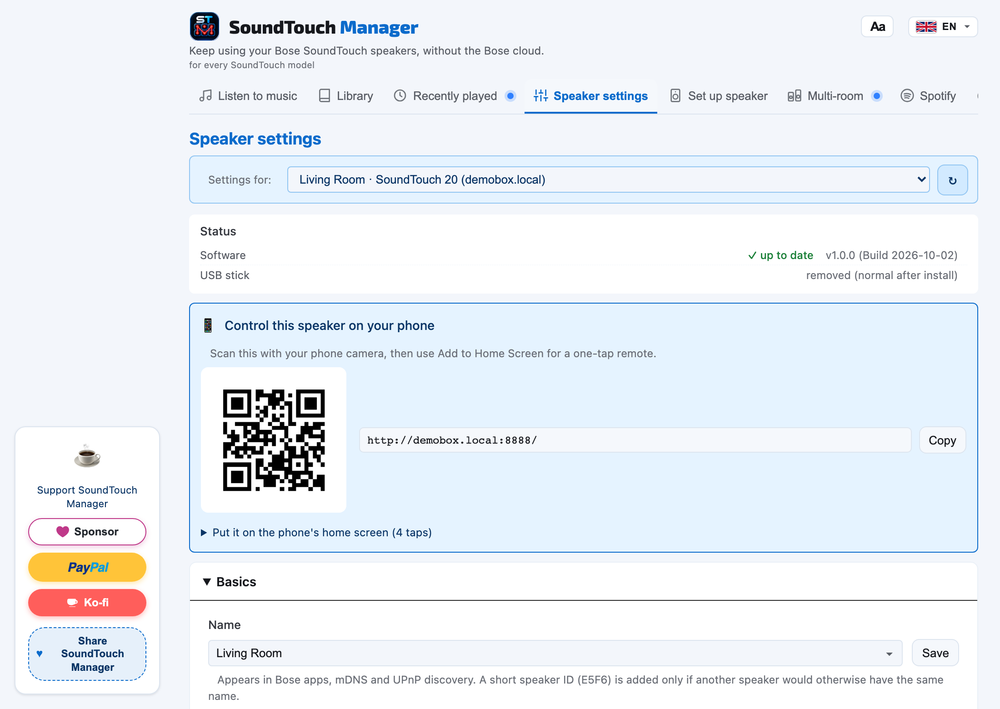
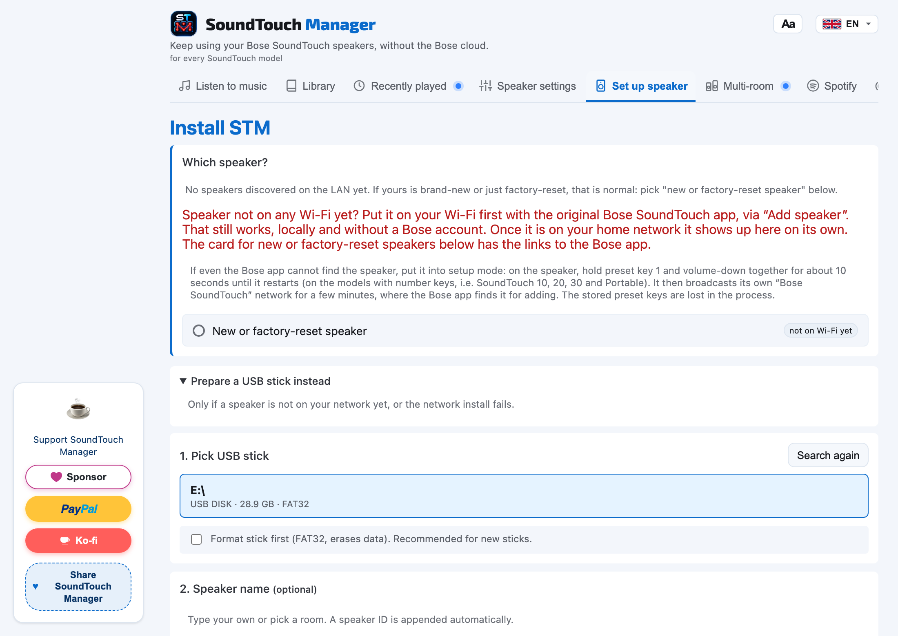
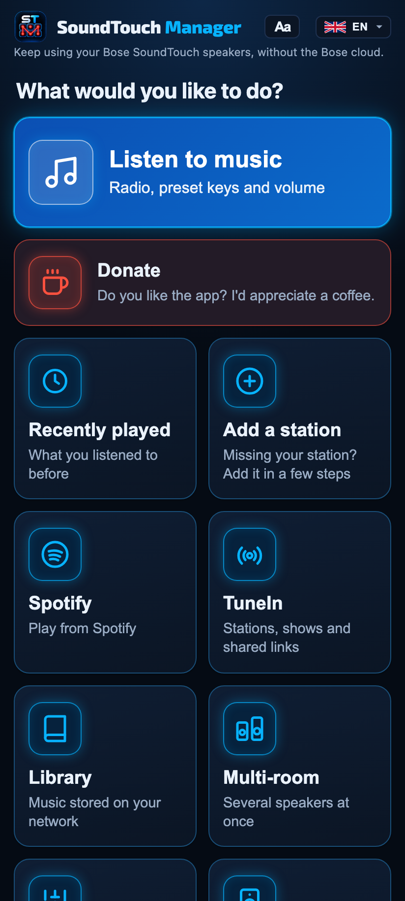
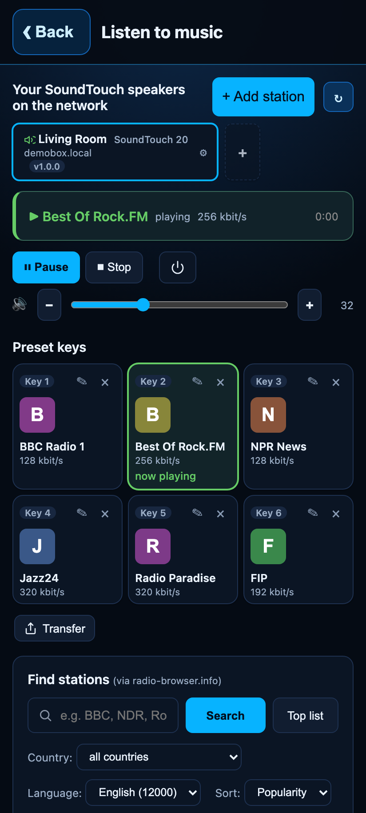
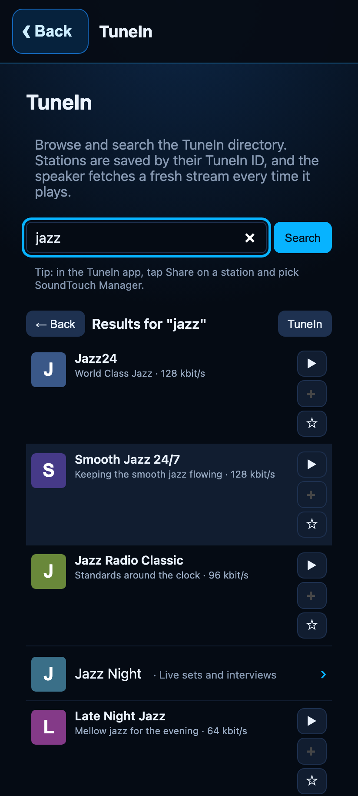

# STM, SoundTouch Manager

**Cloud free firmware project for Bose SoundTouch speakers.**

<p align="center">
  <a href="https://github.com/jcbenitezhe/SoundTouchManager/actions/workflows/build.yml"></a>
  <a href="https://github.com/jcbenitezhe/SoundTouchManager/actions/workflows/codeql.yml"></a>
  <a href="https://github.com/jcbenitezhe/SoundTouchManager/actions/workflows/release.yml"></a>
  <a href="https://scorecard.dev/viewer/?uri=github.com/jcbenitezhe/SoundTouchManager"></a>
  <a href="https://github.com/jcbenitezhe/SoundTouchManager/releases/latest"></a>
  <a href="./LICENSE"></a>
</p>

<p align="center">
  <a href="https://github.com/jcbenitezhe/SoundTouchManager/releases/latest/download/SoundTouchManager-1.0.0-Windows.exe"></a>
  <a href="https://github.com/jcbenitezhe/SoundTouchManager/releases/latest/download/SoundTouchManager-1.0.0-macOS.dmg"></a>
  <a href="https://github.com/jcbenitezhe/SoundTouchManager/releases/latest/download/SoundTouchManager-1.0.0-Linux-x64.tar.gz"></a>
  <a href="https://github.com/jcbenitezhe/SoundTouchManager/releases/latest/download/SoundTouchReborn-1.0.0.apk"></a>
</p>

<p align="center">
  macOS is Apple Silicon (M1 or newer).
  If a browser blocks the Windows file, use the <a href="https://github.com/jcbenitezhe/SoundTouchManager/releases/latest/download/SoundTouchManager-1.0.0-Windows.zip">zip</a>.
  Check the download against <a href="https://github.com/jcbenitezhe/SoundTouchManager/releases/latest/download/SHA256SUMS">SHA256SUMS</a>.
</p>

<p align="center">
  
</p>

Bose discontinued their SoundTouch cloud service in February 2026 and switched the servers off for good on 6 May 2026. STM keeps the speakers usable: a small Go agent is installed onto the speaker itself, stands in for the discontinued cloud locally, and brings back internet radio, Spotify, your own media library, multiroom, and the hardware preset buttons. **The install runs over your home network from the desktop app**, so no USB stick and no second device are needed. The agent persists on the speaker and starts with it on every boot.

## How it works in one paragraph

The desktop app finds the speaker on the network, reaches it on its setup port and copies the agent into the speaker's persistent storage. From then on it starts automatically every time the speaker powers on. A USB stick is still supported as a fallback and recovery path, but it is no longer the normal way to install. It hosts a stand-in for the Bose cloud on the loopback interface and redirects the relevant DNS names so the speaker treats it as the real cloud. Playback then happens over UPnP AVTransport on the speaker, which is supported natively, whether the source is an internet radio station, a Spotify playlist, or a track from a media server on your own network. The hardware preset buttons are wired through the speaker's local WebSocket, so a button press recalls the saved source; the same bus lets a remote key fire a webhook to control your smart home. Several speakers can be grouped into a multiroom zone or a stereo pair.

## Opening the desktop app the first time

Use the download buttons above. The desktop app keeps the PayPal and Ko-fi support links. A first launch often shows a warning because the download is a new file from the internet. The warning does not mean the file is damaged.

- **Windows (SmartScreen):** click **More info**, then **Run anyway**. If the browser blocks the .exe, download the zip and open the file inside.
- **macOS (Gatekeeper):** open the disk image and drag SoundTouch Manager to Applications. Right-click the app, choose **Open**, then **Open** again. Or open **System Settings, Privacy & Security** and click **Open Anyway**.
- **Linux:** extract the archive, run `chmod +x SoundTouchManager-1.0.0-Linux-x64`, and open it. It needs GTK 3 and WebKitGTK 4.1.
- **Android:** open `SoundTouchReborn-1.0.0.apk`. Allow the install from your browser or the Files app, and if Play Protect blocks it choose **More details**, then **Install anyway**. On the phone the app is named SoundTouch Reborn. Support opens GitHub Sponsors, PayPal and Ko-fi.

Compare the file with the `SHA256SUMS` attached to that same release before you open it.

## Screenshots

### Desktop (macOS, Windows, Linux)

The same interface runs on all three desktop systems: browse and assign presets, search internet radio and TuneIn, browse your local media library, manage speaker settings, and install STM onto a speaker over the network.

| | | |
|:--:|:--:|:--:|
| [](docs/screenshots/en/app-listen.png) | [](docs/screenshots/en/app-search.png) | [](docs/screenshots/en/app-tunein.png) |
| Presets and playback | Internet radio search | TuneIn |
| [](docs/screenshots/en/app-library.png) | [](docs/screenshots/en/app-settings1.png) | [](docs/screenshots/en/app-stick-step1.png) |
| DLNA music library | Speaker settings | Install and setup |

### Phone (Android, iOS)

The phone apps open on a home screen of large tiles and carry the same features in a touch layout. Without a speaker, a TuneIn station plays on the phone itself.

| | | |
|:--:|:--:|:--:|
| [](docs/screenshots/mobile/app-home.png) | [](docs/screenshots/mobile/app-listen.png) | [](docs/screenshots/mobile/app-tunein.png) |
| Home | Presets and playback | TuneIn |

The interface is available in thirteen languages (English, German, French, Spanish, Japanese, Ukrainian, Dutch, Polish, Lithuanian, Latvian, Turkish, Arabic, Traditional Chinese). The full per-language screenshot set lives in [`docs/screenshots/`](docs/screenshots/) and is regenerated automatically with `npm run shoot` in `desktop-app/frontend/screenshots/`, a headless Playwright harness that mocks the backend with demo data, so no speaker is needed. `SHOOT_MOBILE=1` renders the phone layout instead.

## Status (August 2026)

STM is pre-1.0. This section is the honest snapshot. No marketing.

### What works

- Discovery of speakers running STM over mDNS, list view in the desktop app. Speakers without STM show up too, marked "ready for STM", and can be installed in-app.
- Playback control: play / pause / stop / volume / bass / source switch (AUX, Bluetooth, Standby) via the speaker's existing UPnP AVTransport endpoint on port 8091. I never route audio through the dead Bose cloud.
- Phone remote: every speaker serves its own remote in the browser. Scan the QR code in the desktop app's speaker settings, add the page to your phone's home screen, and control that speaker, group it, and browse stations and your library from Android or iPhone, with no app store and no account.
- Radio search via radio-browser.info, queried directly by the desktop app (no API key); only the final stream URL goes to the speaker. HLS-only stations (BBC and co.) are converted on the fly by the agent's stream proxy. On a blocked or dead stream the app automatically tries another listing of the same station.
- Six preset slots, persisted by the agent on the speaker. Hardware preset buttons 1 to 6 work after install via a hook into Bose's WebSocket bus (gabbo). Existing non-STM presets (e.g. Deezer) are left untouched. Presets copy from one speaker to the others in one step.
- Spotify Connect: a supervised go-librespot sidecar on the speaker. Spotify playlists, albums, and tracks save to preset slots and the hardware buttons, with multi-account switching and live now-playing. The raw Ogg stream is decoded by the speaker, never by the dead cloud. Streaming quality is set per speaker (160 or 320 kbps), and one click copies a Spotify login to every speaker so saved Spotify presets play on all of them.
- Local media library: browse media servers on your home network over DLNA / UPnP AV (SSDP discovery, ContentDirectory browse), including FRITZ!Box, Synology, Plex and miniDLNA, and save any track as a preset. Lossless files (FLAC) play directly; the agent's stream proxy feeds the box.
- Multiroom zones and stereo pairs: group several speakers to play in sync, or pair two as a left/right stereo pair. Groups persist on the speaker and reform automatically after a reboot, standby cycle, or Wi-Fi outage.
- Smart-home triggers (webhooks): turn a remote-control key, the power button, or an AUX change into a user-configured HTTP call, UDP packet, or Wake-on-LAN magic packet, so a press can drive Home Assistant, ioBroker, Node-RED, wake a PC, or anything reachable on the network.
- OTA agent updates from the desktop app, with an SSH fallback and a pre-reboot stick refresh so the update cannot be reverted by the boot sync. Build stamp comparison catches version drift.
- WLAN reconfigure from the desktop app. I rewrite `/etc/wpa_supplicant.conf` in full because appending breaks Wi-Fi.
- Setup wizard for the install, including preset region, friendly name, box language, and Wi-Fi credentials. The network install is the normal path; the USB stick route (with a bundled FAT32 formatting helper) remains available as a fallback.
- Backup and restore: save your favourites and every speaker's preset keys to one file, and restore them, for example before you rebuild.
- Sleep timer: switch a speaker, or a whole group, off by itself after a set time, from the phone remote.
- Home Assistant and other automation: STM keeps the speaker's local control API (`:8090`) and UPnP media renderer (`:8091`) alive, so a hub you run at home can control the speakers, send audio or TTS to them, and, via Alexa or Google, do voice control. STM adds its own local REST API on top. No cloud skill of my own. See [`docs/HOME-ASSISTANT.md`](./docs/HOME-ASSISTANT.md).
- Diagnostics export (anonymised), true factory reset, and a full "Uninstall STM" that returns the speaker to stock.

### In the works

- **Podcasts**: search a show, play episodes, and subscribe a show to a preset so the newest episode is one button away. Design and feedback.
- **Deezer**: existing Deezer presets on the box already survive an install untouched. Reading and creating Deezer presets from STM is planned (see [`docs/ROADMAP.md`](./docs/ROADMAP.md)).
- **More streaming sources**: SoundCloud, SiriusXM, and Pandora are at the feasibility stage. Like Spotify, each would run through a bridge STM controls, since the speakers' built-in sources died with the cloud.

### Supported models

| Model                       | Status                   |
| --------------------------- | ------------------------ |
| SoundTouch 10               | ✅ Verified on hardware  |
| SoundTouch 20               | ✅ Works (contributor-confirmed) |
| SoundTouch 30               | ✅ Works (confirmed on hardware) |
| SoundTouch Portable         | ✅ Verified on hardware  |
| Wave SoundTouch series III and IV | ✅ Works (network install) |
| SoundTouch 300              | ✅ Works (network install) |
| Bose SA-4 amplifier         | ✅ Works (network install) |
| Bose SA-5 amplifier         | ✅ Works (network install) |
| CineMate 520 and 130        | ✅ Works (network install) |

Per-model detail and the variant fingerprints are in [`docs/MODELS.md`](./docs/MODELS.md). The SoundTouch 300, the SA-4 and SA-5 amplifiers, the Wave systems and the CineMate soundbars never read a USB stick at boot, so the network install is what made these models possible in the first place. If you own a model that is not listed here, I would like to hear from you so we can work out how close it is.

### What I do for security

- DNS pinning for the Bose hostnames (`streaming.bose.com`, `bmx-cloud.*`, TuneIn partner subdomain) to `127.0.0.1` via an `/etc/hosts` bind-mount. The speaker no longer makes outbound queries for these names. This closes the residual domain-squat risk if Bose lets the DNS lapse and someone re-registers it.
- Per-box local TLS CA, generated on first boot, stored in `/mnt/nv/stmanager/ca/`, installed in the speaker's own trust store. Only valid for the loopback-redirected hostnames; the CA private key never leaves the speaker's NAND. The stand-in listeners themselves are LAN-reachable like the rest of the agent surface.

### What I do not do for security yet

- No client authentication on the agent's web UI (`:8888`). Any device on the LAN that can reach the speaker can edit presets and trigger playback.
- No encryption between the desktop app and the agent. Both sit on the LAN, the LAN is the trust boundary.
- No verification of the stock speaker firmware integrity.
- No sandboxing of the desktop application.

### What is inherited from stock Bose firmware (and I do not change)

- HTTP control on `:8090` and UPnP on `:8091` accept any LAN client without authentication. Standard SoundTouch behaviour, not added by me.
- The speakers ship with `root` having no password set, and SSH (port 22) is enabled by Bose's own init script when a `remote_services` file is present on a mounted USB stick. **STM does not hold that port open.** On a normal, stickless boot the speaker ends up with SSH closed; STM only force-starts `sshd` when you deliberately ask for it, by placing the marker file `/mnt/nv/stmanager/enable-ssh` on the speaker. That keeps the repair channel available when an install or update leaves the agent down, without leaving a passwordless root shell on your LAN the rest of the time. While a setup stick is inserted, Bose's own gate opens SSH, which is why the app reminds you to pull the stick after setup. If you switched the marker on, the app's speaker settings show it and tell you how to switch it off again.

### Factory reset

A Bose factory reset clears only what Bose itself knows about: the Bose preset database, account, friendly name, Wi-Fi. It does not touch `/mnt/nv/stmanager/`, which is where my agent binary, CA, preset store, region, name, and the `run-override.sh` hook live. After a factory reset, STM is still installed and boots automatically.

Implication: a speaker being passed on or sold needs a separate "Uninstall STM" step. That ships in the desktop app: Speaker Settings offers **Remove STM** (removes `/mnt/nv/stmanager/` and the boot override, returns the speaker to stock Bose firmware) and a separate **True Factory Reset**. See [`docs/ROADMAP.md`](./docs/ROADMAP.md), "Factory reset wizard", for the remaining level (reset STM data only).

### Pre-1.0 gaps I still owe before tagging 1.0

Per my own criteria in [`CLAUDE.md`](./CLAUDE.md):

1. Two models verified end to end: met (ST10 and Portable verified, ST20 contributor-confirmed with the final stability pass pending, ST30 working on both module variants; see [`docs/MODELS.md`](./docs/MODELS.md)).
2. Hardware preset buttons need to survive cold boot, standby cycle, and Wi-Fi outage. I observe this working, but I do not yet have a regression test that pins it.
3. First-install experience: SmartScreen and Gatekeeper documentation on the website Verify page with the exact click path and a linked SHA256 plus Sigstore attestation. Partially in place, not finalised.
4. Threat model document published. Present in [`docs/THREAT-MODEL.md`](./docs/THREAT-MODEL.md). It does not yet cover the persistence-across-factory-reset point above, which I owe.
5. Legal pages on the website (imprint, privacy, both German). Some sections still contain placeholders.

Additional models beyond the 1.0 threshold, sandboxing the Wails app, and the hardening steps (token auth on `:8888`, iptables egress lockdown, automatic `passwd root` on install) I see as post-1.0. Code signing ships on both desktop platforms already: Windows binaries are Authenticode-signed with a Certum open-source certificate, and the macOS app and disk image are Developer ID signed and notarized by Apple.

## Quick start for developers

```bash
git clone https://github.com/jcbenitezhe/SoundTouchManager.git
cd SoundTouchManager

# Build the stick agent for the speaker hardware (ARMv7l)
make build-arm

# Build the desktop app with embedded helpers and version stamp
# (requires Wails v2 CLI; raw `wails build` leaves the embeds empty)
make wails-build
```

Requirements: Go 1.25 or newer, Node 20 or newer, Wails CLI v2 for the desktop app. Note: on Windows/macOS hosts the agent itself only cross-compiles (`make build-arm`); plain `go build ./...` fails on its Linux-only syscalls.

The website ([jcbenitezhe.github.io/SoundTouchManager](https://jcbenitezhe.github.io/SoundTouchManager/)) is built from `site/` in this repository and published with GitHub Pages.

## Architecture

If you want to understand how the agent, the desktop app, and the speaker's stock firmware fit together (components, ports, data flows for discovery, playback, marge emulation, install, OTA), read [`docs/ARCHITECTURE.md`](./docs/ARCHITECTURE.md). It is short, has diagrams, and is the right starting point for contributors.

## Repository layout

| Path | Description |
|------|-------------|
| `cmd/` | Stick agent entry point, plus `winformat`, `relnotes`, `mdns-probe` helpers |
| `internal/` | Agent-only packages: marge cloud stub, BMX, UPnP, WebSocket hook, preset store, stream proxy, Spotify manager, zones, webhooks |
| `discovery/` | mDNS discovery (top level so the desktop app can import it) |
| `dlna/` | DLNA MediaServer client for the Library tab (top level) |
| `radiobrowser/` | radio-browser.info client for the app-side radio search (top level) |
| `sticksetup/` / `wifiprofiles/` | Embedded stick provisioning + saved-Wi-Fi reader (top level) |
| `usb-stick/` | Bootstrap and runtime scripts on the speaker |
| `setup/` | Legacy PowerShell wizard (superseded by the in-app stick setup) |
| `desktop-app/` | Cross-platform Wails app (own Go module) |
| `.github/` | CI and release workflows |
| `docs/` | Public documentation (architecture, threat model, models, roadmap) |

## Downloads and end user documentation

See the [website](https://jcbenitezhe.github.io/SoundTouchManager/) and the [GitHub releases](https://github.com/jcbenitezhe/SoundTouchManager/releases).

## Verifying release artifacts

Every release on GitHub Releases is built by the official workflow and ships with build provenance attestations via Sigstore. You can verify any binary with:

```bash
gh attestation verify STM-Windows-vX.Y.Z.exe --owner jcbenitezhe
```

Windows builds are additionally Authenticode-signed with a Certum open-source code-signing certificate; check the signature in the file's Properties > Digital Signatures tab or with `signtool verify /pa`.

For the threat model and the vulnerability reporting process see [SECURITY.md](./SECURITY.md) and [docs/THREAT-MODEL.md](./docs/THREAT-MODEL.md).

## How this repo stays clean

Every change is checked automatically and the results are public, so you do not have to take my word for any of it. The badges at the top of this page are live: green means the latest run passed, click one to open the run.

- **CI** runs `golangci-lint`, `govulncheck` (Go vulnerability scan), and the test suite on every push and pull request.
- **CodeQL** runs static security analysis on every push and weekly.
- **OpenSSF Scorecard** audits the supply-chain posture (branch protection, pinned dependencies, signed releases, token hygiene) weekly and publishes the score.
- **Dependabot** keeps Go, npm, and GitHub Actions dependencies patched; all third-party actions are pinned to a commit SHA.
- **Secret Scanning with Push Protection** blocks commits that contain a leaked credential.
- **Releases** are built only by the workflow from a signed tag, with SHA256 sums and Sigstore build-provenance attestations (above). All shipped binaries, including the small speaker shim, are compiled from source by the workflow; no opaque prebuilt binaries are committed.

Findings from Dependabot, CodeQL, and Scorecard surface in the repository's [Security tab](https://github.com/jcbenitezhe/SoundTouchManager/security). The full policy is in [SECURITY.md](./SECURITY.md), and hard-won notes about the stock firmware STM runs on top of are in [docs/FIRMWARE-NOTES.md](./docs/FIRMWARE-NOTES.md).

## Privacy

STM has no accounts, no ads, and no third-party trackers in the app. The speaker never contacts the Bose cloud: STM answers it locally; with Spotify Connect enabled it talks to Spotify's servers. The desktop app talks to radio-browser.info for the station search and to public favicon endpoints for station logos. Its automatic update check is off (no update server is configured); new versions are published on this repository's GitHub releases. The website sets no cookies and uses no analytics. Full breakdown: [docs/ARCHITECTURE.md](./docs/ARCHITECTURE.md#telemetry-analytics-and-privacy).

## Contributing

Issues and pull requests welcome. By submitting a contribution you agree to license it under MIT. Significant changes please open an issue first to discuss the approach.

## Support the project

If STM helped bring your speaker back to life, please consider a donation.

[](https://github.com/sponsors/jcbenitezhe)

More payment options (Ko-fi, PayPal) on the [website](https://jcbenitezhe.github.io/SoundTouchManager/#support).

## Disclaimer

STM is an independent open source project. The abbreviation **ST** references compatibility with Bose SoundTouch family speakers. STM is **not affiliated with, endorsed by, sponsored by, or otherwise connected to** Bose Corporation. **Bose** and **SoundTouch** are registered trademarks of Bose Corporation in the United States and other countries.

STM exists solely to restore functionality of these speakers after the official Bose cloud service shutdown in February 2026. Reverse engineering for interoperability is permitted under EU Directive 2009/24/EC, Article 6, and comparable provisions in other jurisdictions.

The software is provided AS IS, without warranty. Use at your own risk.

## Acknowledgements and third-party software

STM stands on other people's open source. Thank you.

- **[go-librespot](https://github.com/devgianlu/go-librespot)** by devgianlu, **GPL-3.0** , the Spotify Connect client that powers STM's Spotify support. It ships as a **separate binary** that STM runs as a child process and talks to over a local API/pipe; it is not linked into STM, so STM's own MIT code and the GPL-3.0 binary are merely aggregated, each under its own license. STM builds it from a small fork (also GPL-3.0, originally by Jens Roggenfelder) that adds a raw-Ogg passthrough mode; the full source of the bundled build is in [`third_party/go-librespot/`](./third_party/go-librespot/) under its own GPL-3.0 license.
- **[radio-browser.info](https://www.radio-browser.info/)** , the community-run radio station directory STM searches, with no key and no account.
- **[Octicons](https://github.com/primer/octicons)** by GitHub (MIT) , a couple of UI icons.
- **[Bose-SoundTouch](https://github.com/gesellix/Bose-SoundTouch)** by gesellix , the independent cloud emulation whose documented account and BMX service schema STM's native source registration is built on: the numeric `sourceproviderid` catalogue, the `<devices>` block the firmware requires before it accepts an account at all, and the finding that device-local slots such as `UPNP` and `STORED_MUSIC_MEDIA_RENDERER` must never be served to a speaker as account sources. Sponsor: [github.com/sponsors/gesellix](https://github.com/sponsors/gesellix).
- **[bosesoundtouchapi](https://github.com/thlucas1/bosesoundtouchapi)** by thlucas1 , the most complete public reference for the speaker's own REST API on port 8090.
- **[SixBack](https://github.com/tostmann/SixBack)** by Dirk Tostmann , an independent post-shutdown revival project; its documented source-registration behaviour helped separate "source not registered" from "source has no account behind it".
- **[soundcork](https://github.com/deborahgu/soundcork)** , the proxied API specification for the Bose cloud calls, assembled from real speaker traffic.
- **[libsoundtouch](https://github.com/CharlesBlonde/libsoundtouch)** by CharlesBlonde , early documentation of the speaker protocol and the WebSocket event bus.
- **[BoseSoundtouch](https://github.com/TimoGo/BoseSoundtouch)** by TimoGo , documented the TAP CLI sequence for Wi-Fi provisioning, including the `network` prefix the Bose service manual leaves out.
- **[Soundtouch-without-the-app](https://github.com/bosefirmware/Soundtouch-without-the-app)** and the wider **[bosefirmware](https://github.com/bosefirmware)** archive , cloud-free operation of the speakers, and the firmware images that made it possible to tell the chassis generations apart.
- The wider community that documented the SoundTouch TAP CLI and firmware behaviour after the cloud shutdown, whose findings STM builds on.

Bundled components keep their own licenses; STM's own code is MIT.

## License

MIT. See [LICENSE](./LICENSE). The bundled go-librespot binary is GPL-3.0; see the Acknowledgements above.
